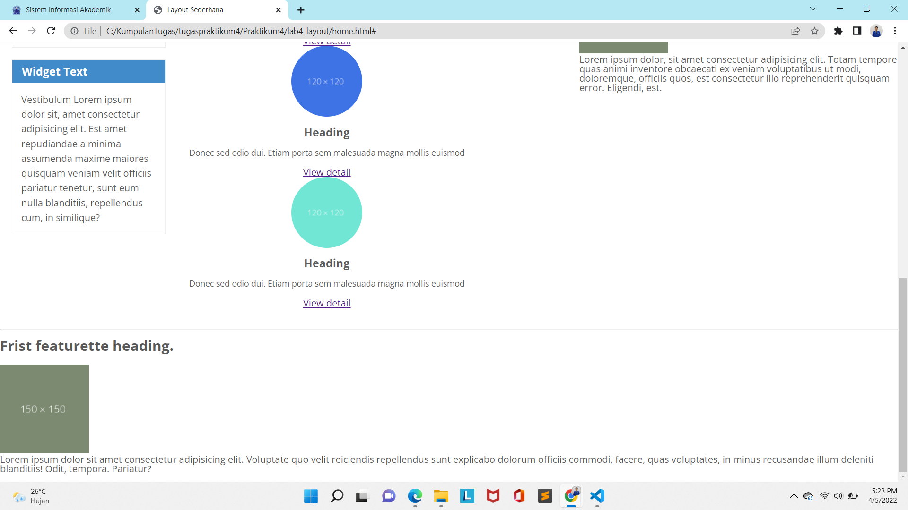

## Praktikum4

# Element div tanpa float property
div {
    padding: 10px;
}
.div1 {
    background: red;
}
.div2 {
    background: yellow;
}
.div3 {
    background: green;
}

<!DOCTYPE html>
<html lang="en">
<head>
    <meta charset="UTF-8">
    <meta name="viewport" content="width=device-width, initial-scale=1.0">
    <title>Praktikum4</title>
    <link rel="stylesheet" type="text/css" href="deklarasitagdiv.css">
    
</head>
<body>

Div 1

Div 2

Div 3

    
</body>
</html>

# Element div dengan float property

# Membuat dokumen HTML dengan nama file lab4_box.html
<!DOCTYPE html>
<html lang="en">
<head>
    <meta charset="UTF-8">
    <meta name="viewport" content="width=device-width, initial-scale=1.0">
    <title>Box Element</title>
</head>
<body>
    <header>
        <h1>Box Element</h1>
    </header>
</body>
</html>

# Membuat Box Element
tambahkan kode untuk membuat box element dengan tag div seperti berikut
<section>
        
Div 1

        
Div 2

        
Div 3

    </section>

# CSS Float Property
tambahkan deklarasi CSS pada head untuk membuat float element, seperti berikut.

    

Kemudian buka browser untuk melihat hasilnya

# Mengatur Clearfix Element
Clearfix digunakan untuk mengatur element setelah float element. Property clear digunakan untuk mengaturnya.

Tambahkan element div lainnya setelah div3 seperti berikut.
<section>
        
Div 1

        
Div 2

        
Div 3

        
Div 4

    </section>

Kemudian atur property clear pada CSS,seperti berikut.
.div4 {
        background: blue;
        clear: left;
        float: none;
}

Selanjutnya buka browser dan refresh kembali.

# Membuat layout sederhana
Buat folder baru dengan nama lab4_layout, kemudian buatlah file baru didalamnya dengan nama home.html, dan file css dengan nama style.css
<!DOCTYPE html>
<html lang="en">
<head>
    <meta charset="UTF-8">
    <meta name="viewport" content="width=device-width, initial-scale=1.0">
    <title>Layout Sederhana</title>
    <link rel="stylesheet" href="style.css">
</head>
<body>
    

    

    
</body>
</html>

Kemudian tulis kode berikut
<header>
        <h1>Layout Sederhana</h1>
    </header>
    <nav>
        <a href="home.html" class="active">Home</a>
        <a href="artikel.html">Artikel</a>
        <a href="about.html">Kontak</a>
    </nav>
    <section id="hero"></section>
    <section id="wrapper">
        <section id="main"></section>
        <aside id="sidebar"></aside>
    </section>
    <footer>
        
&copy; 2021 - Universitas Pelita Bangsa

    </footer>

Kemudian buka browser dan lihat hasilnya.

Kemudian tambahkan kode CSS untuk membuat layoutnya.
/* import google font */
@import 
url('https://fonts.googleapis.com/css2?family=Open+Sans:ital,wght@0,300;0,400;0,600;0,700;0,800;1,300;1,400;1,600;1,700;1,800&display=swap');
@import 
url('https://fonts.googleapis.com/css2?family=Open+Sans+Condensed:ital,wght@0,300;0,700;1,300&display=swap');

/* Reset CSS */
* {
    margin: 0;
    padding: 0;
}

body {
    line-height: 1;
    font-size: 100%;
    font-family: 'Open Sans', sans-serif;
    color: #5a5a5a;
}

#container {
    width: 980px;
    margin: 0 auto;
    box-shadow: 0 0 1em #cccccc;
}

/* header */
header {
    padding: 20px;
}

header h1 {
    margin: 20px 10px;
    color: #b5b5b5;
}

Kemudian lihat hasilnya pada browser.

# Membuat Navigasi
Kemudian selanjutnya mengatur navigasi.
/* header */
header {
    padding: 20px;
}

header h1 {
    margin: 20px 10px;
    color: #b5b5b5;
}

/* navigasi */
nav {
    display: block;
    background-color: #1f5faa;
}

nav a {
    padding: 15px 30px;
    display: inline-block;
    color: #ffffff;
    font-size: 14px;
    text-decoration: none;
    font-weight: bold;
}

nav a.active,
nav a:hover {
    background-color: #2b83ea;
}

Kemudian lihat hasilnya.

Selanjutnya membuat hero panel. Tambahkan kode HTML dan CSS seperti berikut.
<section id="hero">
        <h1>Hello World</h1>
        
Lorem ipsum dolor, sit amet consectetur adipisicing elit. Consequuntur doloremque quasi, cum non officiis molestiae eos cumque ea itaque similique dolor esse, commodi error saepe, eveniet fugiat excepturi ullam nesciunt.

        <a href="home.html" class="btn btn-large">Learn more &raquo;</a>
    </section>

/* Hero Panel */
#hero {
    background-color: #e4e4e5;
    padding: 50px 20px;
    margin-bottom: 20px;
}

#hero h1 {
    margin-bottom: 20px;
    font-size: 35px;
}

#hero p {
    margin-bottom: 20px;
    font-size: 18px;
    line-height: 25px;
}

# Mengatur Layout Main dan Sidebar
Selanjutnya mengatur main content dan sidebar, tambahkan CSS float.
/* main content */
#wrapper {
    margin: 0;
}

#main {
    float: left;
    width: 640px;
    padding: 20px;
}

/* sidebar area */
#sidebar {
    float: left;
    width: 260px;
    padding: 20px;
}

# Membuat Sidebar Widget
Kemudian selanjutnya menambahkan element lain dalam sidebar.
<aside id="sidebar">
        

            <h3 class="title">Widget Header</h3>
            <ul>
                <li><a href="#">Widget Link</a></li>
                <li><a href="#">Widget Link</a></li>
                <li><a href="#">Widget Link</a></li>
                <li><a href="#">Widget Link</a></li>
                <li><a href="#">Widget Link</a></li>
            </ul>
        

        

            <h3 class="title">Widget Text</h3>
            
Vestibulum Lorem ipsum dolor sit, amet consectetur adipisicing elit. Est amet repudiandae a minima assumenda maxime maiores quisquam veniam velit officiis pariatur tenetur, sunt eum nulla blanditiis, repellendus cum, in similique?

        

    </aside>

Kemudian tambahkan CSS.
/* widget */
.widget-box {
    border: 1px solid #eee;
    margin-bottom: 20px;
}

.widget-box .title {
    padding: 10px 16px;
    background-color: #428bca;
    color: #fff;
}

.widget-box ul {
    list-style: none;
}

.widget-box li {
    border-bottom: 1px solid #eee;
}

.widget-box li a {
    padding: 10px 16px;
    color: #333;
    display: block;
    text-decoration: none;
}

.widget-box li:hover a{
    background-color: #eee;
}

.widget-box p {
    padding: 15px;
    line-height: 25px;
}

# Mengatu Footer
Selanjutnya mengatur tampilan footer. Tambahkan CSS untuk footer.
/* footer */
footer {
    clear: both;
    background-color: #1d1d1d;
    padding: 20px;
    color: #eee;
}

# Menambahkan Eleman lainnya pada Main Content

    <section id="main">
        

            

                
                <h3>Heading</h3>
                
Donec sed odio dui. Etiam porta sem malesuada magna mollis euismod

                <a href="#" class="btn btn-default">View detail</a>
            

            

                
                <h3>Heading</h3>
                
Donec sed odio dui. Etiam porta sem malesuada magna mollis euismod

                <a href="#" class="btn btn-default">View detail</a>
            

            

                
                <h3>Heading</h3>
                
Donec sed odio dui. Etiam porta sem malesuada magna mollis euismod

                <a href="#" class="btn btn-default">View detail</a>
            

        

    </section>

Kemudian tambahkan CSS.

/* box */
.box {
    display: block;
    float: left;
    width: 33. 333333%;
    box-sizing: border-box;
    -moz-box-sizing: border-box;
    -webkit-box-sizing: border-box;
    padding: 0 10px;
    text-align: center;
}

.box h3 {
    margin: 15px 0;
}

.box p {
    line-height: 20px;
    font-size: 14px;
    margin-bottom: 15px;
}

box img {
    border: 0;
    vertical-align: middle;
}

.image-circle {
    border-radius: 50%;
}

.row {
    margin: 0 -10px;
    box-sizing: border-box;
    -moz-box-sizing: border-box;
    -webkit-box-sizing: border-box;
}

.row:after, .row:before,
.entry:after, .entry:before {
    content: '';
    display: table;
}

.row:after,
.entry:after {
    clear: both;
}
   

# Menambahkan Content Artikel
Selanjutnya membuat content artikel. Tambahkan HTML berikut pada main content.

    <article class="entry">
        <h2>Frist featurette heading.</h2>
        
        
Lorem ipsum dolor, sit amet consectetur adipisicing elit. Totam tempore quas animi inventore obcaecati ex veniam voluptatibus ut modi, doloremque, officiis quos, est consectetur illo reprehenderit quisquam error. Eligendi, est.

    </article>
    

    <article class="entry">
        <h2>Frist featurette heading.</h2>
        
        
Lorem ipsum dolor sit amet consectetur adipisicing elit. Voluptate quo velit reiciendis repellendus sunt explicabo dolorum officiis commodi, facere, quas voluptates, in minus recusandae illum deleniti blanditiis! Odit, tempora. Pariatur?

    </article>

Kemudian tambahkan CSS.
.divier {
    border: 0;
    border-top: 1px solid #eeeeee;
    margin: 40px 0;
}

/* entry */
.entry {
    margin: 15px 0;
}

.entry h2 {
    margin-bottom: 20px;
}

# Pertanyaan dan Tugas
1 . Tambahkan Layout untuk menu About => buat single layout yang berisi deskripsi,portfolio,dll
2 . Tambahkan layout untuk menu Contact => yang berisi form isian: nama,email,message,dll

# Jawab

# 1 Buat html seperti berikut

        

        <h1 class="title">About me</h1>
         
        
Lorem ipsum dolor sit amet consectetur adipisicing elit. Necessitatibus quis odit a labore dicta, error pariatur ipsum reprehenderit provident temporibus nulla eaque voluptas sunt at vero dignissimos recusandae architecto? Fuga.
 
    

    

        
    

    

kemudian masukkan CSS.
/* Layout About */
.about {
    display: flex;
    align-items: center;
    justify-content: space-between;
    background-color: #e4e4e5;
    clear: both;
    padding: 35px;
    line-height: 25px;
}

.avatar {
    width: 110px;
    border-radius: 50%;
}

kemudian lihat hasilnya

# 2. Buat html seperti berikut
 
 

        <h1>Contact</h1>
        <form class="Kontakform class">
            

                <label for="Nama" class="Kontak label">Nama</label>
                

                    <input type="text" id="Name" name="Name" class="kontak-form-control" required>
                

            

            

                <label for="Name" class="kontak-label">Email</label>
                

                    <input type="text" id="Name" name="Name" class="kontak-form-control" required>
                

            

            

                <label for="Message" class="kontak-label">Message</label>
                

                    <textarea id="Message" name="Message" class="kontak-form-control" rows="6" maxlength="3000" required></textarea>
            

            

            

                <button type="submit" class="kontak-btn kontak-btn-primay kontak-btn-lg kontak-btn-block ">Send Message</button>
            

        </form>
    

    menambahkan css
    /* import google font */
@import 
url('https://fonts.googleapis.com/css2?family=Open+Sans:ital,wght@0,300;0,400;0,600;0,700;0,800;1,300;1,400;1,600;1,700;1,800&display=swap');
@import 
url('https://fonts.googleapis.com/css2?family=Open+Sans+Condensed:ital,wght@0,300;0,700;1,300&display=swap');

/* Reset CSS */
* {
    margin: 0;
    padding: 0;
}

body {
    line-height: 1;
    font-size: 100%;
    font-family: 'Open Sans', sans-serif;
    color: #5a5a5a;
}

#container {
    width: 980px;
    margin: 0 auto;
    box-shadow: 0 0 1em #cccccc;
}

/* header */
header {
    padding: 20px;
}

header h1 {
    margin: 20px 10px;
    color: #b5b5b5;
}

/* navigasi */
nav {
    display: block;
    background-color: #1f5faa;
}

nav a {
    padding: 15px 30px;
    display: inline-block;
    color: #ffffff;
    font-size: 14px;
    text-decoration: none;
    font-weight: bold;
}

nav a.active,
nav a:hover {
    background-color: #2b83ea;
}

/* Hero Panel */
#hero {
    background-color: #e4e4e5;
    padding: 50px 20px;
    margin-bottom: 20px;
}

#hero h1 {
    margin-bottom: 20px;
    font-size: 35px;
}

#hero p {
    margin-bottom: 20px;
    font-size: 18px;
    line-height: 25px;
}

/* main content */
#wrapper {
    margin: 0;
}

#main {
    float: left;
    width: 640px;
    padding: 20px;
}

/* sidebar area */
#sidebar {
    float: left;
    width: 260px;
    padding: 20px;
}

/* widget */
.widget-box {
    border: 1px solid #eee;
    margin-bottom: 20px;
}

.widget-box .title {
    padding: 10px 16px;
    background-color: #428bca;
    color: #fff;
}

.widget-box ul {
    list-style: none;
}

.widget-box li {
    border-bottom: 1px solid #eee;
}

.widget-box li a {
    padding: 10px 16px;
    color: #333;
    display: block;
    text-decoration: none;
}

.widget-box li:hover a{
    background-color: #eee;
}

.widget-box p {
    padding: 15px;
    line-height: 25px;
}

/* footer */
footer {
    clear: both;
    background-color: #1d1d1d;
    padding: 20px;
    color: #eee;
}
/* Layout About */
.about {
    display: flex;
    align-items: center;
    justify-content: space-between;
    background-color: #e4e4e5;
    clear: both;
    padding: 35px;
    line-height: 25px;
}

.avatar {
    width: 110px;
    border-radius: 50%;
}

/* Layout Kontak */
.kontak-body {
    margin: 0;
    font-family: -apple-system, Arial, sans-serif;
    font-size: 1rem;
    font-weight: 400;
    line-height: 1.5;
    text-align: left;
    padding: 30px;
    padding-bottom: 10px ;
    border: 1px solid #ced4da;
    border-radius: 0.25rem;
    max-width: 100%;
}
.kontak-form-group {
    margin-bottom: 1rem;
    
}

.kontak-input-group {
    position: relative;
    display: -ms-flexbox;
    display: flex;
    -ms-flex-wrap: wrap;
    flex-wrap: wrap;
    -ms-flex-align: stretch;
    align-items: stretch;
    width: 100%;
}

.kontak-form-control {
    display: block;
    width: 100%;
    height: calc(1.5em + 0.75rem + 2px);
    padding: 0.375rem 0.75rem;
    font-size: 1rem;
    font-weight: 400;
    line-height: 1.5;
    color: #495057;
    background-color: #fff;
    background-clip: padding-box;
    border: 1px solid #ced4da;
    outline: none;
    border-radius: 0.25rem;
    transition: border-color 0.15s ease-in-out, box-shadow 0.15s ease-in-out;
}

.kontak-form-control:focus {
    border: 1px solid #313131;
}

textarea.kontak-form-control {
    height: auto;
}

label.kontak-label {
    display: inline-block;
    margin-bottom: 0.5rem;
}

.kontak-btn {
    display: inline-block;
    font-weight: 400;
    color: #212529;
    text-align: center;
    vertical-align: middle;
    cursor: pointer;
    -webkit-user-select: none;
    -moz-user-select: none;
    -ms-user-select: none ;
    user-select: none;
    background-color: transparent;
    border: 1px solid transparent;
    padding: 0.375rem 0.75rem;
    font-size: 1rem;
    line-height: 1.5;
    border-radius: 0.25rem;
    transition: color 0.15s ease-in-out, background-color 0.15s ease-in-out, border-color 0.15s ease-in-out
}

.kontak-btn-primary {
    color: #fff;
    background-color: #007bff;
    border-color: #007bff;
}

.kontak-btn-lg,
.kontak-btn-group-lg>
.kontak-btn {
    padding: 0.5rem 1rem;
    font-size: 1.25rem;
    line-height: 1.5;
    border-radius: 0.3rem;
}

input[type="submit"].kontak-btn-block,
input[type="reset"].kontak-btn-block,
input[type="button"].kontak-btn-block {
    width: 100%;
}

/* box */
.box {
    display: block;
    float: left;
    width: 33. 333333%;
    box-sizing: border-box;
    -moz-box-sizing: border-box;
    -webkit-box-sizing: border-box;
    padding: 0 10px;
    text-align: center;
}

.box h3 {
    margin: 15px 0;
}

.box p {
    line-height: 20px;
    font-size: 14px;
    margin-bottom: 15px;
}

box img {
    border: 0;
    vertical-align: middle;
}

.image-circle {
    border-radius: 50%;
}

.row {
    margin: 0 -10px;
    box-sizing: border-box;
    -moz-box-sizing: border-box;
    -webkit-box-sizing: border-box;
}

.row:after, .row:before,
.entry:after, .entry:before {
    content: '';
    display: table;
}

.row:after,
.entry:after {
    clear: both;
}

.divier {
    border: 0;
    border-top: 1px solid #eeeeee;
    margin: 40px 0;
}

/* entry */
.entry {
    margin: 15px 0;
}

.entry h2 {
    margin-bottom: 20px;
}

.entry p {
    line-height: 25px;
}

.entry img {
    float:  left;
    border-radius: 15px;
}

.entry .right-img {
    float: right;
}

Hasilnya

Hasil Akhir ada yang direvisi/dirubah 

